.. _tutorials:

*******************
Tutorials
*******************

.. |br| raw:: html

  

The following is a basic tutorial about the use of the Semi-Automatic Classification Plugin.
Using a semi-automatic approach we are going to rapidly classify a Landsat 8 image and estimate land cover area, in only six phases.

**Download** the `sample dataset <https://docs.google.com/uc?id=0BysUrKXWIDwBNDUxSGZlRGpBYm8&export=download>`_, which is a subset of a Landsat 8 image acquired over Rome, Italy on June 12, 2014 (data available from the U.S. Geological Survey). The zip file can be extracted with any file archiver software (for instance the open source `7-zip <http://www.7-zip.org/>`_).

The dataset includes the metadata file (MTL.txt) and the following **Landsat 8 bands** (16 bit raster) :

* Band 2 = Blue;

* Band 3 = Green;

* Band 4 = Red;

* Band 5 = Near-Infrared;

* Band 6 = Short Wavelength Infrared 1;

* Band 7 = Short Wavelength Infrared 2.

The objective of this tutorial is to classify the following **land cover classes**:

* Class 1 = Water (e.g. surface water);

* Class 2 = Vegetation (e.g. grassland or trees);

* Class 3 = Built-up (e.g. artificial areas, buildings and asphalt);

* Class 4 = Bare soil (e.g. soil without vegetation).

Following, the tutorial phases are illustrated along with a brief description thereof.

.. _conversion_reflectance:
 
Pre processing: Conversion of raster bands from DN to Reflectance
=================================================================

The pre processing phase is required before the actual image processing in order to improve the classification results.
SCP allows for the automated conversion of Landsat DN (i.e. Digital Numbers) to the physical measure of **Top Of Atmosphere reflectance** (TOA, see :ref:`basic_definitions`). Also, SCP implements an image-based **atmospheric correction** using the **DOS1 method** (Dark Object Subtraction 1) as described in :ref:`landsat_conversion_to_reflectance`.
In addition, we are going to create a **color composite** of the image. In particular, the composite RGB = 543 (that is the equivalent of RGB = 432 for Landsat 7) is useful for the interpretation of the image because vegetation pixels appear red (healthy vegetation reflects a large part of the incident light in the near-infrared wavelength, resulting in higher reflectance values for band 5, thus higher values for the associated color red).

Steps:

* Open QGIS and start the Semi-Automatic Classification Plugin;

* Select the :ref:`pre_processing_tab` > :ref:`landsat_tab`;

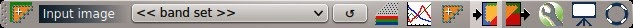

|br|

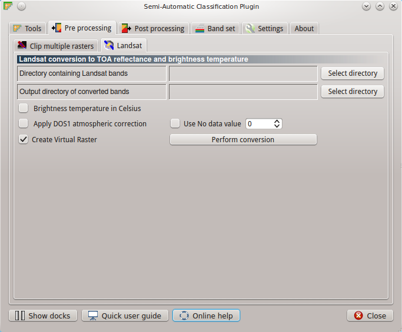

* Select the directory that contains the Landsat bands (and also the required metafile MTL.txt), and select the output directory where converted bands are saved;

* Check the option ``Apply DOS1 atmospheric correction``, and click ``Perform conversion`` to convert Landsat bands to reflectance (leaving checked ``Create Virtual Raster``);

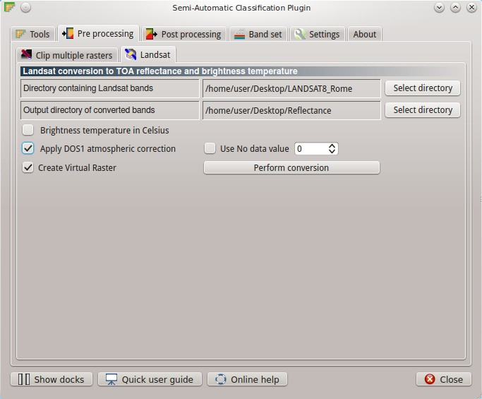

* At the end of the process, converted bands are loaded in QGIS. Also, a virtual raster named ``landsat.vrt`` is loaded (containing all the Landsat bands converted to reflectance), which is useful for the creation of color composites;

* Select the Landsat virtual raster, left click and open its properties; in ``Style`` select band 4 (i.e. Near-Infrared) for the red band, band 3 (i.e. Red) for the green band, and band 2 (i.e. Green) for the blue band.

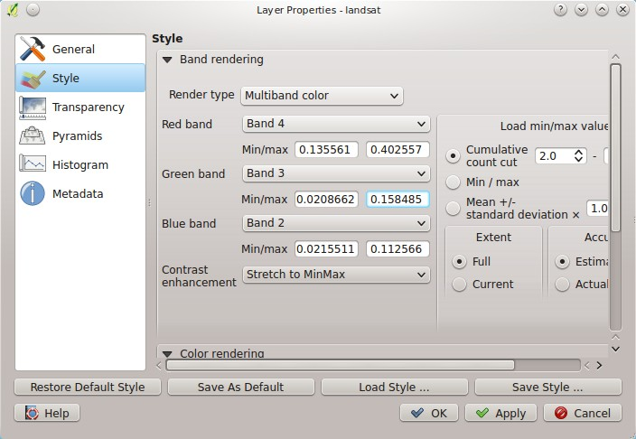

The result of the color composite is shown in the following image.

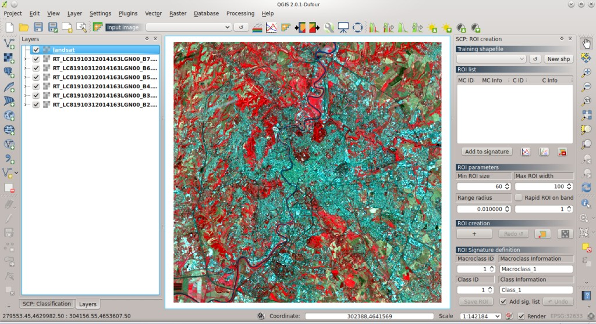

.. _input_definition:
 
Definition of the classification inputs
=======================================

We need to define the **input image** (i.e. the Landsat bands), the **training shapefile** (for the ROI collection), and the **signature list file** (which stores the spectral signatures calculated from ROIs or imported from other sources) in SCP.

Steps:

* Select the :ref:`band_set_tab` (also, a button is available in the SCP :ref:`Toolbar`); click the button ``Select All``, then ``Add rasters to set`` (order the band names in ascending order, from top to bottom using the arrow buttons); then, select the ``Landsat 8 OLI`` from the combo box ``Quick wavelength settings``, in order to set automatically the center wavelength of bands.

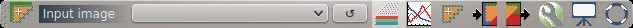

|br|

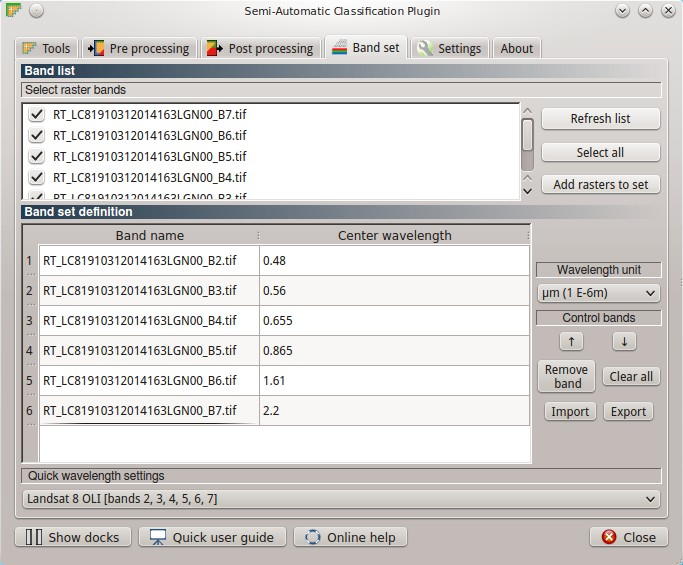

* In order to create the training shapefile, in the :ref:`roi_dock` click the button ``New shp``, and select where to save the shapefile (for instance ``ROI.shp``);

* Click the button ``Save`` in the :ref:`classification_dock`, in order to create a signature list file (for instance ``SIG.xml``).

In the SCP :ref:`toolbar`, the name ``<< band set >>`` is displayed in the combo box ``Input image``. The shapefile name is displayed in the :ref:`training_shapefile` combo box, and the path to the xml file is displayed in the :ref:`signature_list_file`. Now we are ready to collect the ROIs.

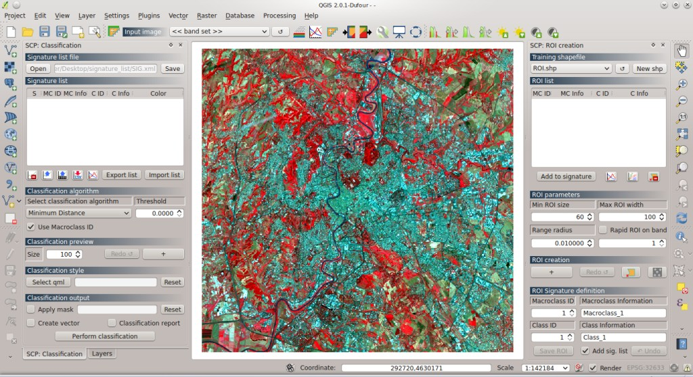

.. _ROI_collection:
 
Collection of ROIs and Spectral Signatures
==========================================

**ROIs** are polygons drawn over homogeneous areas of the image that represent land cover classes. ROIs can be drawn manually or with a region growing process (i.e. image segmentation that groups similar pixels), and they should account for the spectral variability of land cover classes.
SCP calculates the **spectral signatures** (which are used by classification algorithms) considering the pixel values under each ROI.
SCP allows for the definition of a **Macroclass ID** (i.e. MC ID) and a **Class ID** (i.e. C ID) for each ROI or spectral signature, which are the identification codes of land cover classes.
A **Macroclass** is a group of ROIs having different Class ID, which is useful when one needs to classify materials that have different spectral signatures in the same land cover class. For instance we could classify grass (e.g. ``ID class = 1`` and ``Macroclass ID = 1`` ) and trees (e.g. ``ID class = 2`` and ``Macroclass ID = 1`` ) as a vegetation class (e.g. ``Macroclass ID = 1`` ) as shown in Figure :ref:`figMC_example`.

.. _figMC_example:

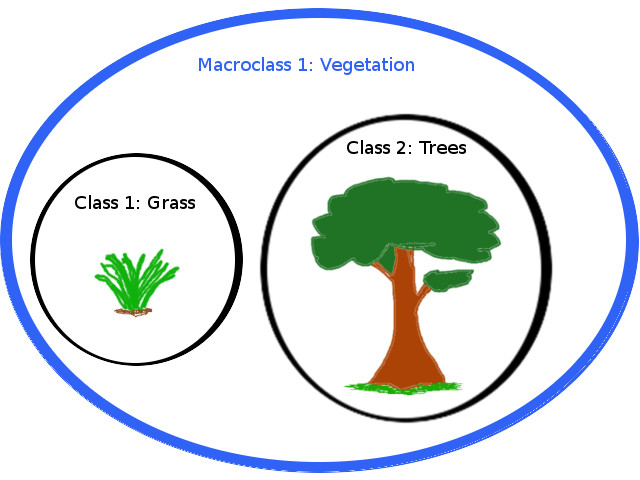
	
	:guilabel:`Macroclass example`
	
Every ROI (or spectral signature) should have a unique C ID, while the MC ID can be shared with other ROIs. In the :ref:`classification_dock` it is possible to choose between MC ID and C ID classification.

Steps:

* In order to **create a ROI**, in the dock :ref:`roi_dock` click the button ``+`` beside ``Create`` a ROI and then click any pixel of the image; zoom in the map and click on a blue pixel of the Tiber river (in order to define the ROI extent, change the :ref:`ROI_parameters` for ``Min ROI size`` and ``Range radius``); after a few seconds the ROI polygon will appear over the image (a semitransparent orange polygon);

	**Tip**: ROIs are placed inside a group named ``Class_temp_group``; if no ROI is displayed, move the group on top of other layers in QGIS.
	
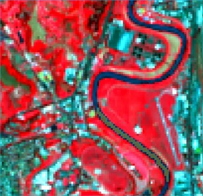

* Under :ref:`ROI_signature_definition` type a brief description of the ROI inside the field ``C Info`` and ``MC Info``, and assign a Macroclass ID and Class ID (these codes can renamed and changed later from the :ref:`ROI_list` table, thus changing also the values in the training shapefile);

* In order to save the ROI to the training shapefile click the button ``Save ROI``; if the checkbox ``Add sig. list`` is checked, then the spectral signature is calculated and added to the :ref:`signature_list` table; also, it is possible to add signatures later, highlighting the ROIs in the :ref:`ROI_list` and clicking ``Add to signature`` (if two or more highlighted ROIs have the same MC ID and C ID, a unique spectral signature is calculated considering all the pixels that are under those ROIs);

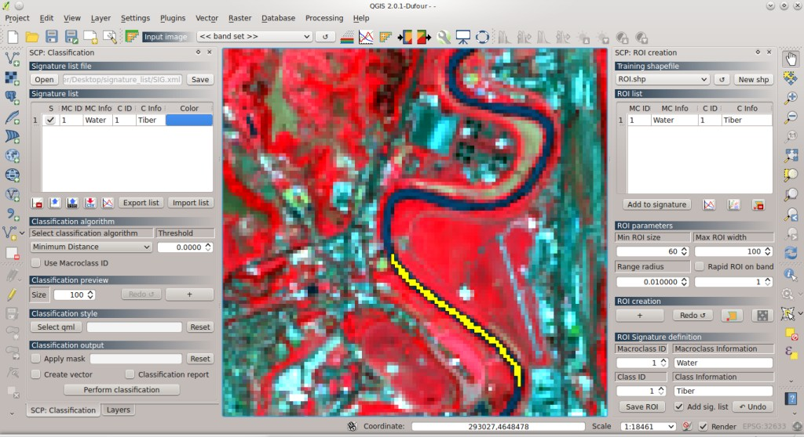

* Define the color of classes that will be used in the classification, with a double click on the ``Color`` column in the :ref:`signature_list` (the signature list is automatically saved when you save the QGIS project, or when you click the button ``Save`` in the :ref:`classification_dock`).

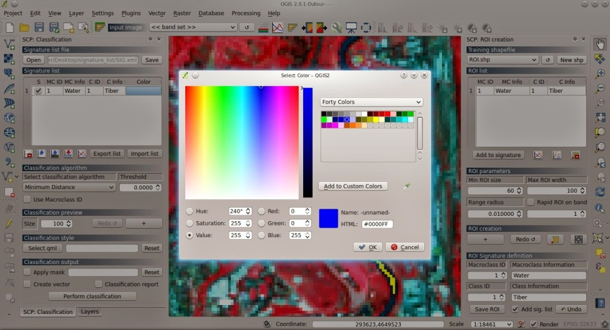

Repeat the above steps for every land cover class, and assign to each ROI a new incremental Class ID, and the following Macroclass IDs:

* Water (e.g. surface water): MC ID = 1

* Vegetation (e.g. grassland or trees): MC ID = 2 

* Built-up (e.g. artificial areas, buildings and asphalt): MC ID = 3

* Bare soil (e.g. soil without vegetation): MC ID = 4

Following, a few examples of ROIs created for these land cover classes.

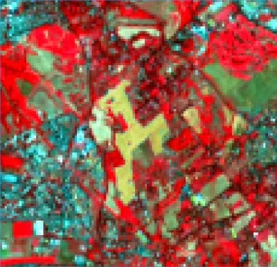
	
	:guilabel:`Bare soil`

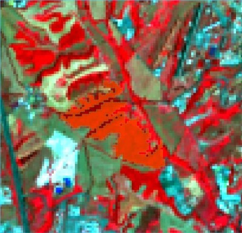
	
	:guilabel:`Vegetation: trees`

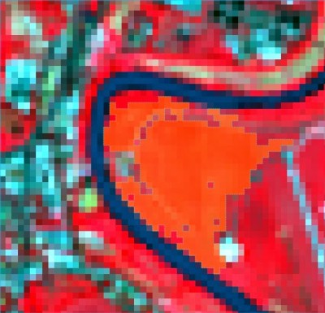
	
	:guilabel:`Vegetation: grass`

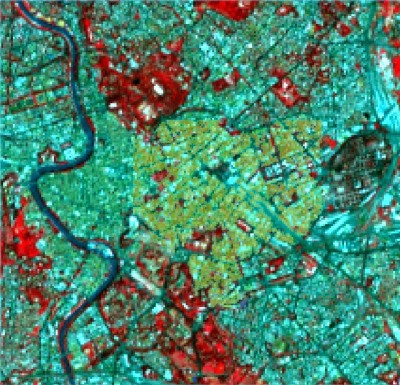
	
	:guilabel:`Built-up`

After the collection of several ROIs, it is useful to display the **spectral signatures** thereof, in order to assess the spectral similarity:

* In the :ref:`signature_list` table, highlight one or more signatures, and click the button |sign_plot|; in the :ref:`spectral_signature_plot`, if the checkox `Plot` :math:`\sigma` is checked, then the plot will display the standard deviation of signatures.
	
.. |sign_plot| image:: _static/semiautomaticclassificationplugin_sign_tool.png
	:width: 20pt

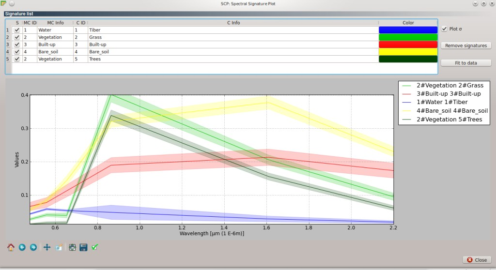

You can download the final `training shapefile <https://docs.google.com/uc?id=0BysUrKXWIDwBYkFmUGtEZEFucWc&export=download>`_ and `spectral signature list <https://docs.google.com/uc?id=0BysUrKXWIDwBMkxFUVo4akk0X00&export=download>`_, where 11 spectral signatures were collected.

.. _classification:
 
Classification of the study area
================================

SCP allows for **classification previews**, in order to assess very rapidly the classification results.
Classifications previews are useful during the collection of ROIs, and for the selection of the more accurate spectral signatures.
If the preview results are considered good (i.e. classes are correctly identified), the **classification of the entire image** can be performed. Otherwise, it is possible to remove one or more spectral signatures, or add new spectral signatures creating other ROIs as described in :ref:`ROI_collection`.

Steps:

* In the :ref:`classification_dock`, under :ref:`classification_preview` set ``Size`` = 500 (i.e. the side of the classification preview in pixel unit), and select the algorithm ``Spectral Angle Mapping``; click the button ``+`` and then click on the image; after a few seconds, the classification preview will be displayed;

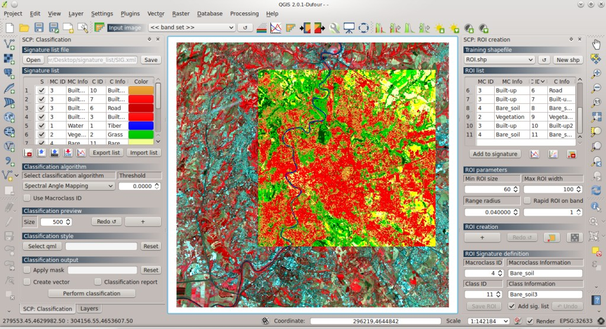

* Check ``Use Macroclass ID``, and click the button ``Redo``; another preview will be performed, but now using macroclasses;

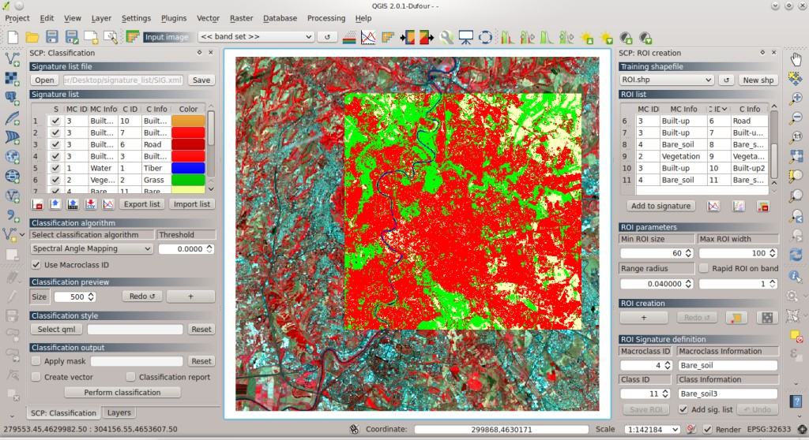

* In order to perform the final classification, click the button ``Perform classification`` and select where to save the output (e.g. ``classification.tif``).

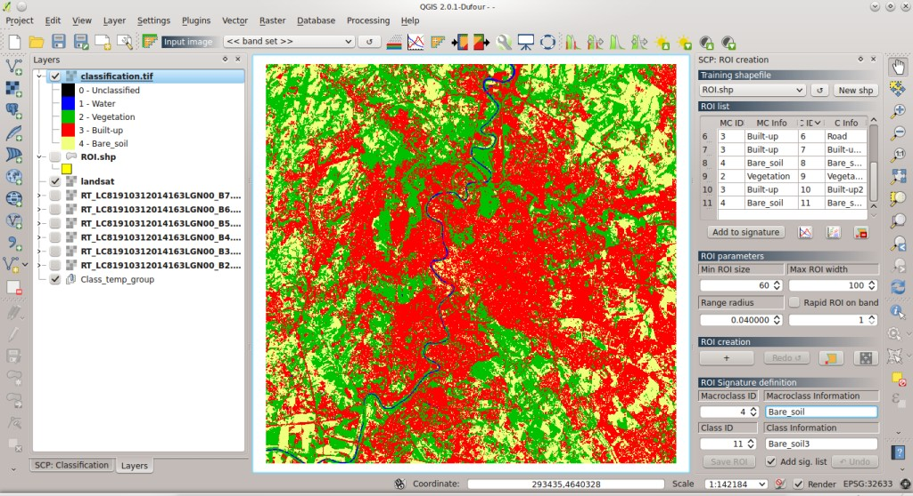

The final land cover classification can be downloaded from `here <https://docs.google.com/uc?id=0BysUrKXWIDwBUW5obHpWZzEtZE0&export=download>`_.

	**Tip**: during the ROI/Signature collection, perform some classification previews using the Class ID, in order to assess how individual spectral signatures affect the classification; then check ``Use Macroclass ID``, in order to calculate the final land cover classification.

.. _accuracy:
 
Calculation of classification accuracy
======================================

The **accuracy assessment of land cover classification** is useful for identifying map errors. SCP allows for the calculation of accuracy comparing the classification raster to a reference shapefile.
Usually, accuracy assessment requires ancillary data and field survey. In this tutorial we are are going to compare the land cover classification to the training ROIs.

Steps:

* Select the :ref:`post_processing_tab` > :ref:`accuracy_tab`;

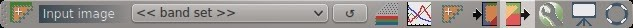

|br|

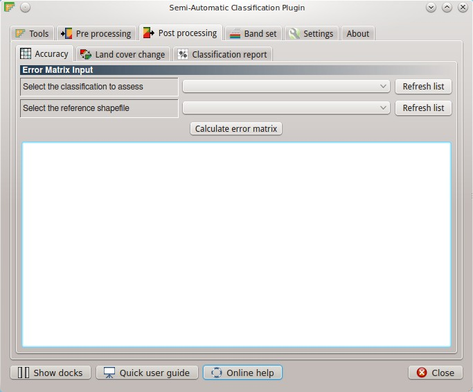

* Select the ``classification.tif`` beside ``Select the classification to assess`` and select the ROI shapefile beside ``Select the reference shapefile``;

* Click the button ``Calculate error matrix`` and select a directory where the error matrix (a .csv file separated by tab) and the error raster are saved; the error matrix will be displayed, and the error raster will be loaded in QGIS, showing the errors in the map (each value of this raster represents a class of comparison between classification and reference shapefile, which is the ``ErrorMatrixCode`` in the error matrix file).	

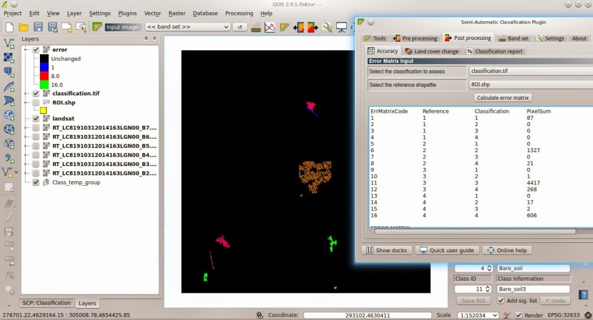

The results of the error matrix show an overall accuracy of 95%, which is very good.
The following error matrix represents the number of pixels classified correctly in the major diagonal. As you can see, most of the errors are between class 3 (built-up) and 4 (bare soil).

+--------------------+---------------+-----------------+-------------+-------------+-------------+
|                    |  Reference    |                 |             |             |             |
+====================+===============+=================+=============+=============+=============+
| **Classification** |   **1**       |    **2**        |    **3**    |    **4**    |   **Total** |
+--------------------+---------------+-----------------+-------------+-------------+-------------+
| **1**              |   87          |    0            |    0        |    0        |   87        |
+--------------------+---------------+-----------------+-------------+-------------+-------------+
| **2**              |   0           |    1327         |    1        |    17       |   1345      |
+--------------------+---------------+-----------------+-------------+-------------+-------------+
| **3**              |   0           |    0            |    4417     |    2        |   4419      |
+--------------------+---------------+-----------------+-------------+-------------+-------------+
| **4**              |   0           |    21           |    268      |    606      |   895       |
+--------------------+---------------+-----------------+-------------+-------------+-------------+
| **Total**          |   87          |    1348         |    4686     |    625      |   6746      |
+--------------------+---------------+-----------------+-------------+-------------+-------------+

From the error matrix file, we have also calculated the accuracy of user and producer; the results show that class 4 (bare soil) has high commission error (100 - user accuracy) and low omission error (100 - producer accuracy).  In order to improve the results, we should collect more ROIs and spectral signatures for the bare soil class, paying attention to the spectral similarity with the built-up class.

* Class 1: producer accuracy [%] = 100.0; user accuracy [%] = 100.0

* Class 2: producer accuracy [%] = 98.44; user accuracy [%] = 98.66

* Class 3: producer accuracy [%] = 94.26; user accuracy [%] = 99.96

* Class 4: producer accuracy [%] = 96.96; user accuracy [%] = 67.71

.. _class_area:
 
Calculation of the area of classes
==================================

SCP allows for the calculation of a **classification report** with the percentage and the area of land cover classes.

Steps:

* Select the :ref:`post_processing_tab` > :ref:`classification_report_tab`;

.. image:: _static/t23.jpg

|br|

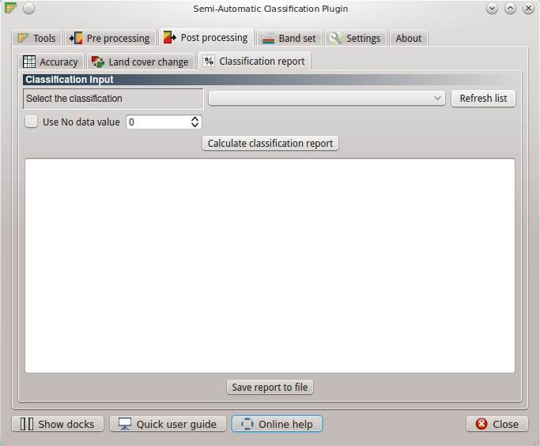

* Select ``classification.tif`` beside ``Select the classification`` and click ``Calculate classification report``;

* After a few seconds the report will be displayed, showing the percentage and the area (area unit is calculated from the image itself).

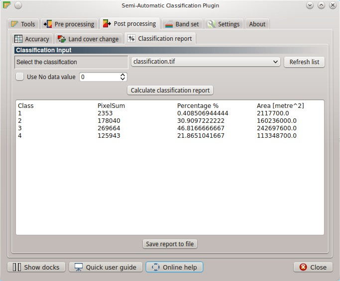

Following, the report table.

+--------------------+---------------+-----------------+-------------------+
|     Class          |  PixelSum     |  Percentage %   | Area [metre^2]    |
+====================+===============+=================+===================+
|     1              |   2353        |    0.41         |    2117700        |
+--------------------+---------------+-----------------+-------------------+
|     2              |   178040      |    30.91        |    160236000      |
+--------------------+---------------+-----------------+-------------------+
|     3              |   269664      |    46.82        |    242697600      |
+--------------------+---------------+-----------------+-------------------+
|     4              |   125943      |    21.86        |    113348700      |
+--------------------+---------------+-----------------+-------------------+

From these **results**, we can see that about 31% of the study area is vegetated, 47% is occupied by built-up, 22% is bare soil surface (also in agricultural areas), and 0.4% is surface water.
Of course, these figures are the result of a tutorial for demonstrating the main features of the SCP for the land cover classification of a Landsat image; several ROIs for each class are required for a good classification (only 11 ROIs were collected in this tutorial), considering their spectral variability; also, field data is useful for improving the collection of ROIs and spectral signatures.

Following the video of this tutorial.

.. raw:: html

	<iframe allowfullscreen="" frameborder="0" height="360" src="http://www.youtube.com/embed/Uq2S3_InQ8A?rel=0" width="640"></iframe>

http://www.youtube.com/watch?v=Uq2S3_InQ8A

Please, visit the blog `From GIS to Remote Sensing <http://fromgistors.blogspot.com/search/label/Tutorial>`_ for other tutorials such as:

* `Estimation of Land Surface Temperature with Landsat Thermal Infrared Band <http://fromgistors.blogspot.com/2014/01/estimation-of-land-surface-temperature.html>`_;

* `Land Cover Classification of Cropland <http://fromgistors.blogspot.com/2014/01/land-cover-classification-of-cropland.html>`_.
