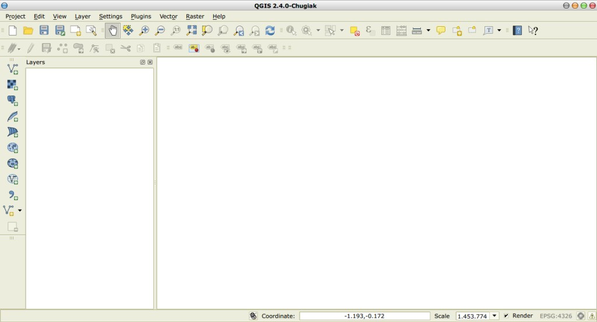
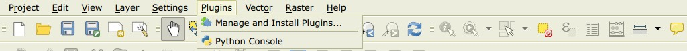
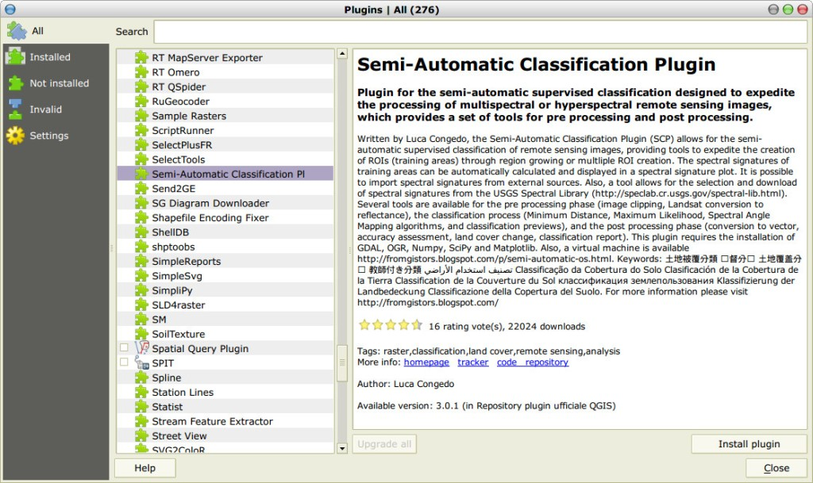
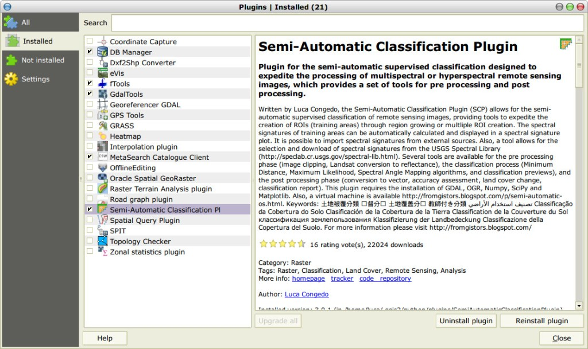
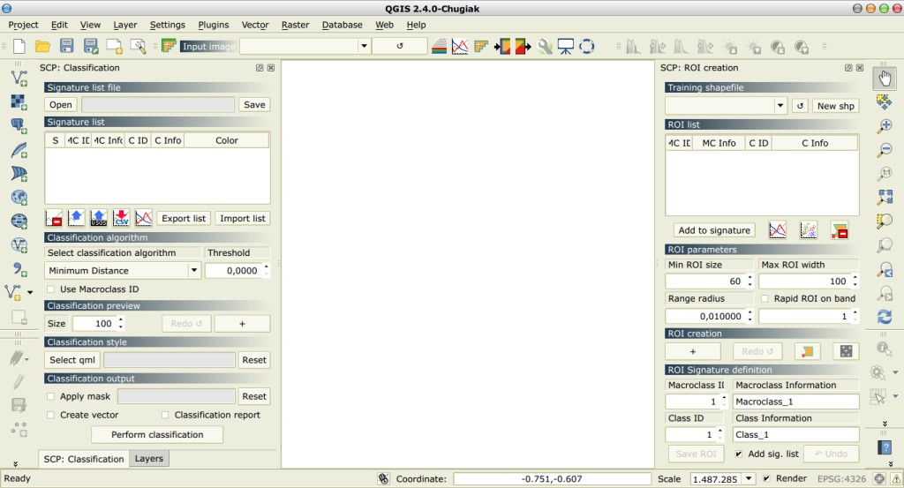
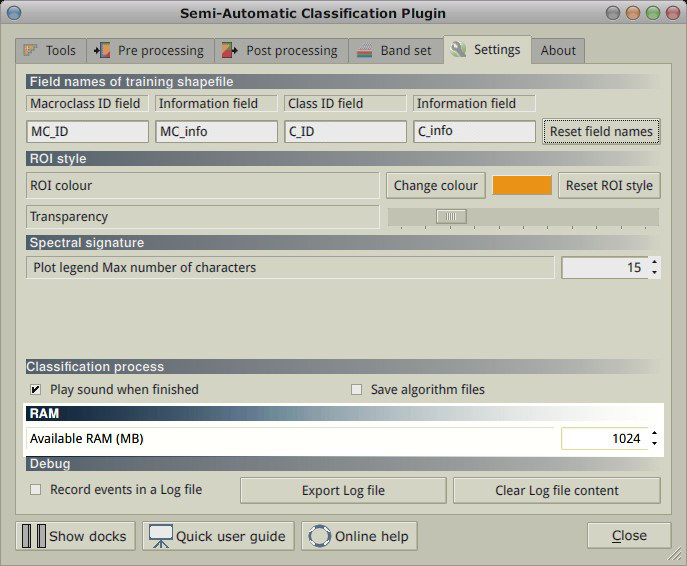

.. _installation_mac:

***********************
Installation in Mac OS
***********************

.. |br| raw:: html

	 

.. _QGIS_installation_mac:
 
QGIS download and installation
------------------------------

* Download and install the latest version of QGIS and GDAL from `here <http://www.kyngchaos.com/software/qgis>`_ .

* In addition, download and install the python modules Numpy, Scipy, and Matplotlib from this `link <http://www.kyngchaos.com/software/python>`_ .

Now, QGIS 2 is installed.

.. _plugin_installation_mac:
 
Semi-Automatic Classification Plugin installation
--------------------------------------------------

* Run QGIS 2;

* From the main menu, select ``Plugins`` > ``Manage and Install Plugins``;

* From the menu ``All``, select the Semi-Automatic Classification Plugin and click the button ``Install plugin``;

* The SCP should be automatically activated; however, be sure that the Semi-Automatic Classification Plugin is checked in the menu ``Installed`` (the restart of QGIS could be necessary to complete the SCP installation);

.. _plugin_configuration_mac:

Configuration of the plugin
---------------------------

Now, the Semi-Automatic Classification Plugin is installed and two docks and a toolbar should be added to QGIS. If not, the SCP is available under the Raster menu of QGIS. It is possible to move the :ref:`toolbar` and the docks according to your needs, as in the following image.
	

The configuration of available RAM is recommended in order to reduce the processing time. Click the button |settings| in the SCP :ref:`toolbar` to open the :ref:`settings_tab`, and set the ``Available RAM`` to a value that should be half of the system RAM. For instance, if your system has 2GB of RAM, set the value to 1024.

.. |settings| image:: _static/settings.png
	:width: 20pt
	
