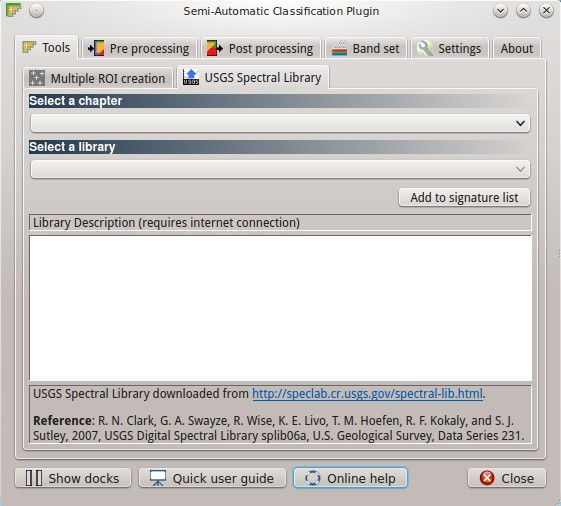
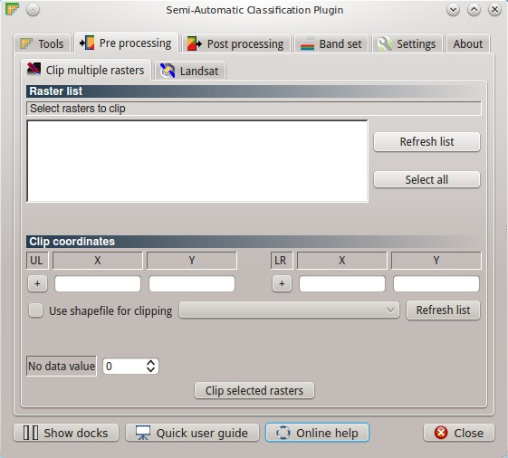
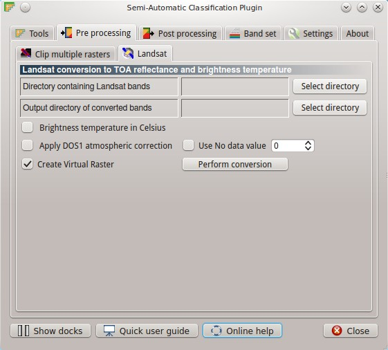
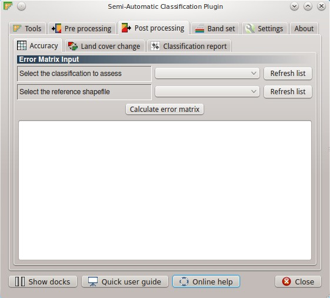
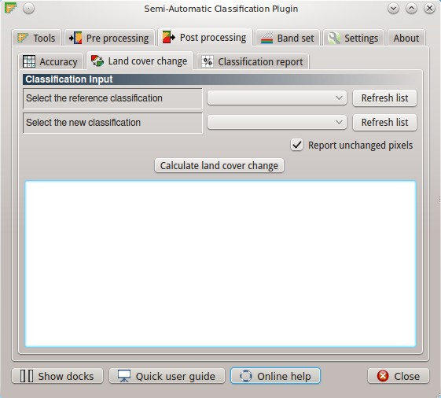
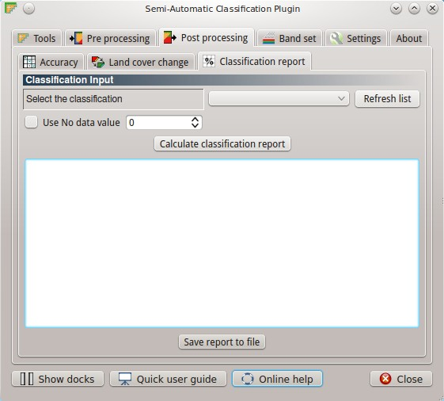
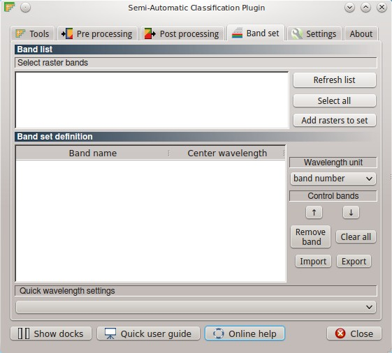
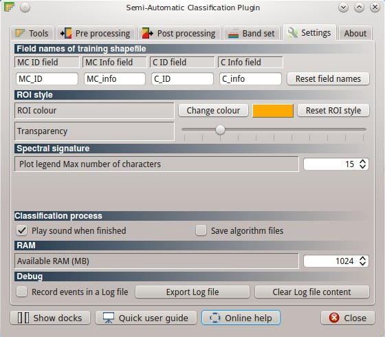

.. _main_interface_window:

******************************
Main Interface Window
******************************

.. |br| raw:: html

  

The Main Interface Window is composed of several tabs grouped in sections. Each section contains several functions that are useful for the classification process, the pre processing of images, and the post processing of land cover classifications.

Three buttons are always available:

* ``Show docks`` : show the :ref:`roi_dock` and the :ref:`classification_dock` if closed;
* ``Quick user guide`` : open the online user manual in a web browser;
* ``Online help`` : open the `Online help <http://fromgistors.blogspot.com/p/ask-for-help.html>`_ in a web browser, where it is possible to ask for help or report any issue regarding the Semi-Automatic Classification Plugin and the Semi-Automatic OS.

Following, the list of tabs and the description thereof:

.. contents::
    :depth: 2
    :local:
	

.. _tools_tab:
 
Tools tab
==========

The tab ``Tools`` includes several tools for the creation and manipulation of ROI and spectral signatures.

.. _multiple_rois_tab:

Multiple ROI Creation tab
-------------------------

.. figure:: _static/multiple_ROIs.jpg
	:align: center
	:width: 400pt
	
	:guilabel:`Multiple ROI Creation`

The tab ``Multiple ROI Creation`` allows for the automatic creation of ROIs, useful for the rapid classification of multi-temporal images, or for creating several ROIs using GPS data from field survey.
It performs the region growing of ROIs at user defined points, requiring a list of point coordinates and class definitions. Created ROIs are automatically saved to the :ref:`training_shapefile`.

.. _point_coordinates:

Point coordinates and ROI definition
^^^^^^^^^^^^^^^^^^^^^^^^^^^^^^^^^^^^

* Table fields:
	* ``X [float]`` : point X coordinate;
	* ``Y [float]`` : point Y coordinate;
	* ``MC ID [int]`` : ROI Macroclass ID;
	* ``MC Info [text]`` : ROI Macroclass Information;
	* ``Class ID [int]`` : ROI Class ID;
	* ``C Info [text]`` : ROI Class Information;
	* ``Min size [int]`` : the minimum area of a ROI (in pixel unit) when created using a region growing algorithm on a specific band;
	* ``Max width [int]`` : the maximum width of a ROI (i.e. the side lenght of a square, centered at the seed pixel, which inscribes the ROI) in pixel unit;
	* ``Range radius [float]`` : the interval which defines the maximum spectral distance between the seed pixel and the surrounding pixels (in radiometry unit); if the ROI size is less then ``Min size`` then the ``Range radius`` is overridden and ROI is created using the most similar pixels until size is at least ``Min size``;
	* ``Rapid ROI band [int]`` : if defined, ROI is created only on the selected band of raster (the process is rapider than creating ROI using all the available bands); if empty, the resulting ROI is the intersection of ROIs calculated on each band (therefore it can be smaller than ``Min size`` );
* [ ``Add point`` ]: add a new row to the table for the definition a point; all the table fields must be filled for the ROI creation;
* [ ``Remove highlighted points`` ]: delete the highlighted rows from the table;
* [ ``Import point list`` ]: import a point list from text file to the table; every line of the text file must contain values separated by tabs of ``X [float]``, ``Y [float]``, ``MC ID [int]``, ``MC Info [text]``, ``Class ID [int]``, ``C Info [text]``, ``Min size [int]``, ``Max width [int]``, ``Range radius [float]``, and optionally the ``Rapid ROI band [int]``;
* [ ``Export point list`` ]: export the point list to text file;
* [ ``Create and save ROIs`` ]: start the ROI creation process for all the points and save ROIs to the Training shapefile;
* ``Add sig. list``: if checked, calculate ROI spectral signatures and add them to the :ref:`signature_list`.

Following a brief video of this tool.

.. raw:: html

	<iframe allowfullscreen="" frameborder="0" height="360" src="http://www.youtube.com/embed/of49IWLnJ9k?rel=0" width="640"></iframe>

http://www.youtube.com/watch?v=of49IWLnJ9k

.. _USGS_spec_library_tab:

USGS Spectral Library tab
-------------------------

	
	:guilabel:`USGS Spectral Library`

The tab ``USGS Spectral Library`` allows for the download of the `USGS spectral library <http://speclab.cr.usgs.gov/spectral-lib.html>`_ (Clark, R.N., Swayze, G.A., Wise, R., Livo, E., Hoefen, T., Kokaly, R., Sutley, S.J., 2007, USGS digital spectral library splib06a: U.S. Geological Survey, Digital Data Series 231). The libraries are grouped in chapters including Minerals, Mixtures, Coatings, Volatiles, Man-Made, Plants, Vegetation Communities,
Mixtures with Vegetation, and Microorganisms.
The downloaded library is automatically sampled according to the image band wavelengths defined in the :ref:`band_set_tab`, and added to the :ref:`signature_list`.

.. _select_chapter:

Select a chapter
^^^^^^^^^^^^^^^^^

* ``Select a chapter`` : select one of the library chapters; after the selection, chapter libraries are shown in :ref:`select_library`;

.. _select_library:

Select a library
^^^^^^^^^^^^^^^^^

* ``Select a library`` : select one of the libraries; the library description is displayed in the frame ``Library description``;
* ``Add to signature list [internet connection required]`` : download the library and add the sampled spectral signature to the :ref:`signature_list` using the parameters defined in :ref:`ROI_signature_definition`.

	**Tip**: spectral libraries downloaded from the ``USGS Spectral Library`` can be used with the Minimum Distance or Spectral Angle Mapping algorithms, but not used with the Maximum Likelihood algorithm.

Following a brief video of this tool.

.. raw:: html

	<iframe allowfullscreen="" frameborder="0" height="360" src="http://www.youtube.com/embed/RSDuXJHjvgE?rel=0" width="640"></iframe>

http://www.youtube.com/watch?v=RSDuXJHjvgE
	
.. _pre_processing_tab:
 
Pre processing tab
==================

The ``Pre processing`` tab allows for the manipulation of images before the actual classification process.

.. _clip_multiple_rasters_tab:

Clip multiple rasters tab
-------------------------

	
	:guilabel:`Clip multiple rasters`

The tab ``Clip multiple rasters`` allows for cutting several image bands at once, using a rectangle defined with point coordinates or a boundary defined with a shapefile.

.. _raster_list:

Raster list
^^^^^^^^^^^

* [ ``Refresh list`` ]: refresh layer list;
* [ ``Select all`` ]: select all the rasters to be clipped.

.. _clip_coordinates:

Clip coordinates
^^^^^^^^^^^^^^^^

* [+]: click on the map for the definition of the Upper Left (UL) and Lower Right (LR) point coordinates (X and Y) of the rectangle used for clipping;
* ``Use shapefile for clipping``: if checked, use the selected shapefile (loaded in QGIS) for clipping, overriding point coordinates;
* < ``No data value`` >: set the value for 'No data' pixels (e.g. outside the clipped area);
* [ ``Clip selected rasters`` ]: open a window for choosing the output destination; rasters selected in the :ref:`raster_list` are clipped, saved in the output directory with the prefix ``clip_``, and automatically loaded in QGIS.

Following a brief video of this tool.

.. raw:: html

	<iframe allowfullscreen="" frameborder="0" height="360" src="http://www.youtube.com/embed/8FL0A6eVyzk?rel=0" width="640"></iframe>

http://www.youtube.com/watch?v=8FL0A6eVyzk

.. _landsat_tab:
 
Landsat tab
-----------

	
	:guilabel:`Landsat`
	
The tab ``Landsat`` allows for the conversion of Landsat images from DN (i.e. Digital Numbers) to the physical measure of Top Of Atmosphere reflectance (TOA), or the application of a simple atmospheric correction using the DOS1 method (Dark Object Subtraction 1), which is an image-based technique (for more information about the Landsat conversion to TOA and DOS1 correction, see :ref:`landsat_conversion_to_reflectance`).

.. _landsat_conversion:

Landsat conversion to TOA reflectance and brightness temperature
^^^^^^^^^^^^^^^^^^^^^^^^^^^^^^^^^^^^^^^^^^^^^^^^^^^^^^^^^^^^^^^^

* [ ``Select a directory`` ]: select the ``Directory containing Landsat bands`` (file names thereof must end with the respective number) and the metafile (a .txt file whit the suffix MTL) are stored; all bands found in this directory are converted automatically (it works with **Landsat 4, 5, 7, and 8**);
* [ ``Select a directory`` ]: open a window for choosing the ``Output directory of converted bands``;
* ``Brightness temperature in Celsius`` : if checked, convert brightness temperature to Celsius (default is Kelvin);
* ``Apply DOS1 atmospheric correction`` : if checked, the DOS1 atmospheric correction is applied to all the bands (thermal bands excluded);
* ``Use No data value`` : if checked, 'No data' values are not counted during the DOS1 calculation of DNmin (for more information about the Landsat conversion to TOA and DOS1 correction, see :ref:`landsat_conversion_to_reflectance`);
* [ ``Create Virtual Raster`` ]: if checked, a virtual raster named ``landast.vrt`` is created and loaded in QGIS after the conversion;
* [ ``Perform conversion`` ]: start the conversion process; converted Landsat bands are saved in the output directory with the prefix ``RT_``, and automatically loaded in QGIS.

	**Tip**: only the bands found in the ``Directory containing Landsat bands`` are processed; therefore, it is possible to convert only certain bands if the other ones are removed from the input directory. The metafile (MTL) is always required.
	
.. raw:: html

	<iframe allowfullscreen="" frameborder="0" height="360" src="http://www.youtube.com/embed/pNXKGoDy0ag?rel=0" width="640"></iframe>

http://www.youtube.com/watch?v=pNXKGoDy0ag
	
.. _post_processing_tab:
 
Post processing tab
===================

The tab ``Post processing`` provides several functions that can be applied to the classification output.

.. _accuracy_tab:
 
Accuracy tab
------------

	
	:guilabel:`Accuracy`
	
The tab ``Accuracy`` allows for the comparison of a classification to a reference shapefile in order to assess the classification accuracy. The reference shapefile must have two fields named the same as the Macroclass ID and Class ID fields in the training shapefile; if ``Use Macroclass ID`` is checked in the :ref:`classification_alg`, then the Macroclass ID field of the shapefile is used as reference for the classes, otherwise the Class ID field is used. 

.. _error_matrix_input:

Error Matrix Input
^^^^^^^^^^^^^^^^^^

* ``Select the classification to assess`` : select a classification raster;
* ``Select the reference shapefile`` : select a shapefile, used as reference layer (ground truth) for the accuracy assessment;
* [ ``Refresh list`` ]: refresh layer list;
* [ ``Calculate error matrix`` ]: open a window for choosing where to save the error raster (i.e. a .tif file showing the errors in the map, where each value represents a class of comparison between the classification and reference shapefile, which is the ``ErrorMatrixCode`` in the error matrix) and the error matrix (i.e. a .csv file separated by tab, with the same name defined for the .tif file), and start the calculation; the error matrix will be displayed in the tab frame and the error raster will be loaded in QGIS.
	
.. raw:: html

	<iframe allowfullscreen="" frameborder="0" height="360" src="http://www.youtube.com/embed/lSZbief-ZuU?rel=0" width="640"></iframe>

http://www.youtube.com/watch?v=lSZbief-ZuU
	
.. _land_cover_change_tab:

Land cover change tab 
---------------------

	
	:guilabel:`Land cover change`
	
The tab ``Land cover change`` allows for the comparison between two classifications in order to assess the land cover changes.

.. _classification_input:

Classification input
^^^^^^^^^^^^^^^^^^^^

* ``Select the reference classification`` : select a reference classification raster;
* ``Select the new classification`` : select a new classification raster, to be compared with the reference classification;
* ``Report unchanged pixels``: if checked, report also unchanged pixels;
* [ ``Calculate land cover change`` ]: open a window for choosing where to save the land cover change raster (i.e. a .tif file, where each value represents a class of comparison between the two classifications, which is the ``ChangeCode`` in the land cover change statistics) and the land cover change statistics (i.e. a file .csv saved in the same folder, with the same name defined for the .tif file), and start the calculation; the land cover change statistics will be displayed in the tab frame and the land cover change raster will be loaded in QGIS.

.. raw:: html

	<iframe allowfullscreen="" frameborder="0" height="360" src="http://www.youtube.com/embed/uFZd91E_68o?rel=0" width="640"></iframe>

http://www.youtube.com/watch?v=uFZd91E_68o

.. _classification_report_tab:

Classification report tab 
-------------------------

	
	:guilabel:`Classification report`
	
The tab ``Classification report`` allows for the calculation of class statistics as number of pixels, percentage and area (area unit is calculated from the image itself).

.. _classification_input2:

Classification input
^^^^^^^^^^^^^^^^^^^^

* ``Select the classification`` : select a classification raster;
* [ ``Refresh list`` ]: refresh layer list;
* ``Use No data value`` : if checked, 'No data' values are not counted in the report;
* [ ``Calculate classification report`` ]: calculate the report and display it in the tab frame;
* [ ``Save report to file`` ]: save the report to a .csv file.

.. raw:: html

	<iframe allowfullscreen="" frameborder="0" height="360" src="http://www.youtube.com/embed/6aD8vOPydUo?rel=0" width="640"></iframe>

http://www.youtube.com/watch?v=6aD8vOPydUo

.. _band_set_tab:
 
Band set tab
============

	
	:guilabel:`Band set`
	
The tab ``Band set`` allows for the definition of a set of single band rasters loaded in QGIS, used as ``Input image``. This tab allows for the definition of the ``Center wavelength`` of bands, which is required also for single multispectral rasters in order to calculate properly the spectral signatures.
If a band set is defined, then the ``Image list`` in the :ref:`toolbar` will contain the item `<< band set >>`.

.. _band_list:

Band list
---------

* [ ``Refresh list`` ]: refresh raster band list;
* [ ``Select all`` ]: select all raster bands;
* [ ``Add rasters to set`` ]: add selected rasters to the band set; the band set is stored in the QGIS project.

.. _band_set_definition:

Band set definition
-------------------

* ``Wavelength unit``: select the wavelength unit;
* ``Control bands``:
	* [ :math:`\uparrow` ]: move highlighted bands upward;
	* [ :math:`\downarrow` ]: move highlighted bands downward;
	* [ ``Remove band`` ]: remove highlighted bands from the band set;
	* [ ``Clear all`` ]: clear all bands from band set;
	* [ ``Import`` ]: import a previously saved band set from file;
	* [ ``Export`` ]: export the band set to a file.
* ``Quick wavelength settings``: rapid definition of band center wavelength for several satellite sensors: Landsat 8 OLI, Landsat 7 ETM+, Landsat 4-5 TM, RapidEye, SPOT 4, SPOT 5, SPOT 6, Pleiades, QuickBird;

	**Tip**: Although it is recommended to define the ``Center wavelength`` of bands, it is possible to assign the band number instead of the wavelength. Of course, the :ref:`USGS_spec_library_tab` will not be useful, but the ROI collection and the classification process will still be working.

.. raw:: html

	<iframe allowfullscreen="" frameborder="0" height="360" src="http://www.youtube.com/embed/FYaWcG0fX_0?rel=0" width="640"></iframe>

http://www.youtube.com/watch?v=FYaWcG0fX_0
	
.. _settings_tab:
 
Settings tab
============

	
	:guilabel:`Settings`
	
The tab ``Settings`` allows for the customization of the required fields in the training shapefile, and other parameters useful during the ROI collection and classification.
In addition, the tab ``Settings`` contains debugging utilities for the creation of a Log file (i.e. recording of plugin activities for reporting issues).

.. _field_names_training_shapefile:

Field names of training shapefile
---------------------------------

* [ ``MC ID field`` ]: name of the Macroclass ID field (default is ``MC_ID``);
* [ ``MC Info field`` ]: name of the Information field (default is ``MC_info``);
* [ ``C ID field`` ]: name of the ID field (default is ``C_ID``);
* [ ``C Info field`` ]: name of the Information field (default is ``C_info``);
* [ ``Reset field names`` ]: reset field names to default.

	**Tip**: these settings allow for using a shapefile having different field names, without editing the shapefile. It is sufficient to change the field names according to the shapefile fields. Thus, the shapefile loaded in QGIS will be listed in the :ref:`training_shapefile` (see this `video <http://youtu.be/4V4Fh_MWgSA?t=2m53s>`_ ).
	
.. _roi_style:

ROI style
---------

* [ ``Change colour`` ]: change ROI colour; this configuration is stored in the QGIS registry;
* [ ``Reset ROI style`` ]: reset ROI colour and transparency to default;
* [- ``Transparency`` -]: change ROI transparency; this configuration is stored in the QGIS registry.

.. _spectral_signature:

Spectral signature
------------------

* < ``Plot legend Max number of characters`` >: limit the text length of names in the spectral plot legend.

.. _classification_process:

Classification process
-----------------------

* ``Play sound when finished``: play a sound when the classification process is completed; this configuration is stored in the QGIS registry;
* ``Save algorithm files``: in addition to the classification output, save the intermediate files calculated by the classification algorithm (one .tif file for each land cover class representing the `similarity` of each pixel to the class thereof); this configuration is stored in the QGIS registry.

.. _ram:

RAM
---

* < ``Available RAM (MB)`` >: set the available RAM (in MB) that will be used during the processes; this configuration is stored in the QGIS registry.

.. _debug:

Debug
-----

* ``Records events in a log file`` : start recording events in a Log file; this configuration is stored in the QGIS registry;
* [ ``Export Log file`` ]: open a window for choosing where to save the Log file (i.e. a .txt file).
* [ ``Clear Log file content`` ]: clear the content of Log file.

.. raw:: html

	<iframe allowfullscreen="" frameborder="0" height="360" src="http://www.youtube.com/embed/4V4Fh_MWgSA?rel=0" width="640"></iframe>

http://www.youtube.com/watch?v=4V4Fh_MWgSA
