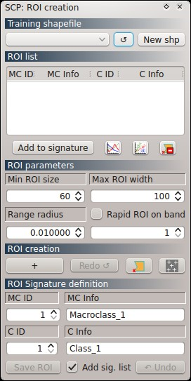
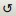

.. _roi_dock:

******************************
ROI Creation dock
******************************

.. |br| raw:: html

  

	
	:guilabel:`ROI creation`
		
The dock ``ROI creation`` allows for the definition of a **training shapefile**, and for the creation of **ROIs** using a **region growing** algorithm or **manual drawing**.

ROIs (Regions Of Interest) are polygons that can be created automatically using a region growing algorithm (i.e. image is segmented around a pixel seed), by clicking on an image pixel. This way, created ROIs include spectrally homogeneous pixels. Alternatively, ROIs can be created manually by drawing a polygon. Created ROIs are temporary polygons, until they are saved in the training shapefile, which are placed inside a group named ``Class_temp_group`` , and deleted when the QGIS project is closed.

ROIs are then saved in a training shapefile, created by the SCP, which contains several fields required for the classification process.
	
ROIs are defined with the Macroclass ID, Macroclass Information (e.g. macroclass name), Class ID, and Class Information (e.g. class name).
The **Class** ID is a unique identifier for each land cover class. A **Macroclass** is a group of ROIs having different Class ID, which is useful when one needs to classify materials that have different spectral signatures in the same land cover class.

Each Class ID must be assigned to only one Macroclass ID (i.e. each class can have only one macroclass), but several Class IDs can be assigned to the same Macroclass ID (i.e. different classes can have the same macroclass). Of course, several ROIs can share the same Class ID.

The use of the Macroclass ID for classifications is defined with the option ``Use Macroclass ID`` in the :ref:`classification_alg`. If the option ``Use Macroclass ID`` is unchecked, then the classification is performed using the ID class only (e.g. grass and trees are classified as class 1 and 2 respectively).
If one does not need macroclasses, then simply assign the same Macroclass ID to all ROIs (e.g. 1) and uncheck the option ``Use Macroclass ID`` in the :ref:`classification_alg`.
	
.. _training_shapefile:
 
Training shapefile
==================

* ``Select a training shapefile`` : a shapefile, for the collection of ROIs used during the classification; the shapefile must contain at least four fields: ``MC_ID`` [int], ``MC_info`` [string], ``C_ID`` [int], and ``C_info`` [string] (custom names can be defined in the :ref:`settings_tab`);
* |refresh|: refresh layer list;
* [ ``New shp`` ]: create a new shapefile containing the required fields Macroclass ID, Macroclass Information , Class ID, and Class Information.
	
	**Tip**: If you need to use an existing shapefile having different field names edit the :ref:`field_names_training_shapefile`.
		

	
.. _ROI_list:
 
ROI list
==================

The ``ROI list`` display the ROI collected in the ``Training shapefile``. Double click on any table item to zoom in the map to that ROI; also, with a single click on any item, it is possible to change the ROI IDs and Infos directly.

* Table fields:
	* ``MC ID [int]`` : ROI Macroclass ID;
	* ``MC Info [text]`` : ROI Macroclass Information;
	* ``C ID [int]`` : ROI Class ID;
	* ``C Info [text]`` : ROI Class Information;
* ``Add to signature`` : calculate ROI spectral signature and add it to the :ref:`signature_list`;
* |sign_plot| : calculate ROI spectral signature and show it in the :ref:`spectral_signature_plot`;
* |scatter_plot| : open the :ref:`scatter_plot`;
* |delete_ROI| : delete highlighted ROIs from the ``Training shapefile``.
	
	**Tip**: in order to calculate a single spectral signature from multiple ROIs having the same ``MC ID`` and ``C_ID``, highlight those ROIs in the ``ROI list`` and click the button ``Add to signature``.
	
.. |sign_plot| image:: _static/semiautomaticclassificationplugin_sign_tool.png
	:width: 20pt
		
.. |scatter_plot| image:: _static/semiautomaticclassificationplugin_scatter_tool.png
	:width: 20pt
			
.. |delete_ROI| image:: _static/semiautomaticclassificationplugin_delete_ROI.png
	:width: 20pt
	
.. _ROI_parameters:

ROI parameters
==============

* ``Min ROI size`` : the minimum area of a ROI (in pixel unit) when created using a region growing algorithm on a specific band;
* ``Max ROI width`` : the maximum width of a ROI (i.e. the side lenght of a square, centered at the seed pixel, which inscribes the ROI) in pixel unit;
* ``Range radius`` : the interval which defines the maximum spectral distance between the seed pixel and the surrounding pixels (in radiometry unit); if the ROI size is less then ``Min ROI size`` then the ``Range radius`` is overridden and ROI is created using the most similar pixels until size is at least ``Min ROI size``;
* ``Rapid ROI on band`` : if checked, ROI is created only on the selected band of raster (the process is rapider than creating a ROI using all the available bands); if unchecked, the resulting ROI is the intersection of ROIs calculated on each band (therefore it can be smaller than ``Min ROI size`` ); this configuration is stored in the QGIS project.

.. _ROI_creation:

ROI creation
============

* [+]: recall the pointer for ROI creation using the region growing algorithm;
* [ ``Redo`` ]: create a new ROI at the same point of the previous one;
* |manual|: create a ROI by manual drawing of a polygon on the image; after clicking the button, left click on the image to define the ROI vertices and right click on the image to define the last vertex and close the polygon;
* |multiple|: open the :ref:`multiple_rois_tab`.

.. |manual| image:: _static/semiautomaticclassificationplugin_manual_ROI.jpg
	:width: 24pt

.. |multiple| image:: _static/semiautomaticclassificationplugin_roi_multiple.png
	:width: 24pt

.. _ROI_signature_definition:

ROI Signature definition
========================

* ``MC ID`` : ROI Macroclass ID; this ID is used for the classification process as reference for the land cover classes when the option ``Use Macroclass ID`` in the :ref:`classification_dock` is checked;
* ``MC Info`` : ROI Macroclass information; this field is used to write a brief description of the Macroclass (this description is not used in the classification process and does not influence the classification);
* ``C ID`` : ROI Class ID; this ID is used for the classification process as reference for the land cover classes when the option ``Use Macroclass ID`` in the :ref:`classification_dock` is unchecked;
* ``C Info`` : ROI Class information; this field is used to write a brief description of the class (this description is not used in the classification process and does not influence the classification);
* [ ``Save ROI`` ]: save the last created ROI to the training shapefile;
* [ ``Undo`` ]: delete the last saved ROI from the training shapefile;
* ``Add sig. list``: if checked, the spectral signature is calculated (the ROI mean value and standard deviation for each raster band, and the covariance matrix) while the ROI is saved to shapefile (it takes some time depending on the number of image bands); this configuration is stored in the QGIS project.

Following a brief video of this tool.

.. raw:: html

	<iframe allowfullscreen="" frameborder="0" height="360" src="http://www.youtube.com/embed/cSNIlnM4tPo?rel=0" width="640"></iframe>

http://www.youtube.com/watch?v=cSNIlnM4tPo
