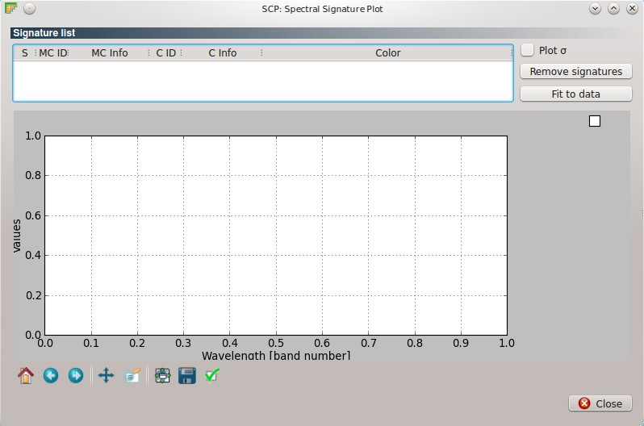
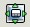

.. _spectral_signature_plot:

******************************
Spectral Signature Plot
******************************

.. |br| raw:: html

  

The ``Spectral Signature Plot`` window allows for the displaying of spectral signature plots, which are the signature values (usually reflectance) as a function of wavelength. Signatures can be added to the ``Spectral Signature Plot`` through the :ref:`roi_dock` and the :ref:`classification_dock`.

	
	:guilabel:`Spectral Signature Plot`

.. _signature_list_plot:

Signature list
----------------------

* Table fields:
	* ``S`` : checkbox field; if checked, then signature is displayed in the plot;
	* ``MC ID`` : Macroclass ID;
	* ``MC Info`` : Macroclass Information;
	* ``Class ID`` : Class ID;
	* ``C Info`` : Class Information;
	* ``Color`` : color field; double click to select a color for the plot;
* ``Plot`` :math:`\sigma` : if checked, plot the standard deviation for each signature;
* [ ``Remove signatures`` ]: remove highlighted signatures from the list;
* [ ``Fit to data`` ]: resize the plot to fit to all the data.
* Plot commands (from Matplotlib):
	* |m_home|: Reset to original view;
	* |m_back|: Back to previous view;
	* |m_forward|: Forward to next view;
	* |m_pan|: Pan axes with left mouse, zoom with right;
	* |m_zoom|: Zoom to rectangle;
	* |m_sub|: Unused;
	* |m_save|: Save plot to a figure (e.g. JPG file); 
	* |m_edit|: Unused.

|br|

	**Tip**: it is possible to move the legend with the mouse.

	

	

	

	

	

	

	